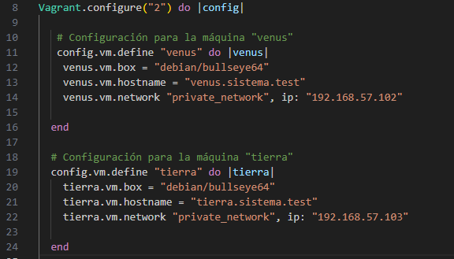
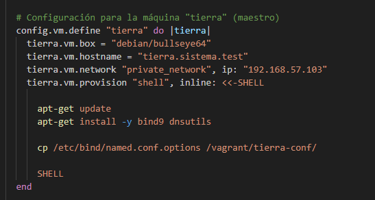
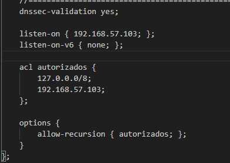

# DNS-sistTest
La siguiente práctica tiene un servidor DNS maestro, otro esclavo con una zona directa e inversa.

1. Creamos un archivo .gitignore para que ignore el directorio .vagrant y los ficheros de backup (.back y *~)

2. Crear las máquinas Venus y Tierra con bullseye64
    

    2.1 Necesito copiar los archivos de las máquinas para que se puedan subir a GitHub
    
        (Aquí solo copié un archivo)

3. Datos del DNS 
    1. Escucha del protocolo IPv4
    2. dnssec-validation a yes
    3. Permitir consultas recursivas con acl

      

    4. tierra.sistema.tes es el servidor maestro
        a. Configura la zona directa e indirecta
        

        b. Archivo de zona directa
       
            En este archivo hay un error, falta poner un registro A para tierra.sistema.test
        c. Archivo de zona indirecta
       

    5. Configuración servidor esclavo    
        a. En el fichero named.conf.local. También índica el maestro
         

    6. Configurar el tiempo en caché de las respuestas negativas a dos horas
        a. Zona directa
        

        b. Zona indirecta
        

    7. Reenviar consultas que no pueda resolver al servidor de OpenDNS (208.67.222.222).
        
